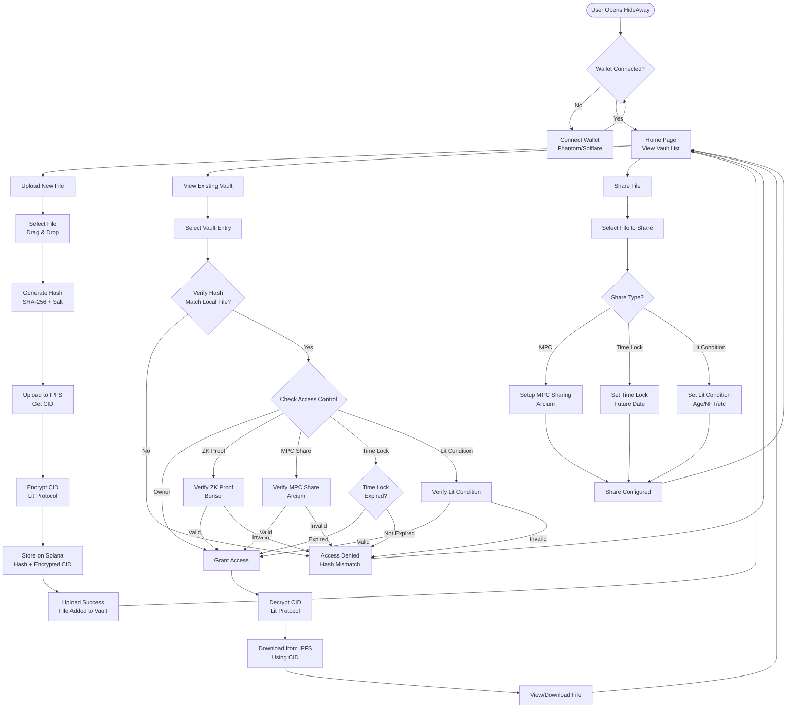
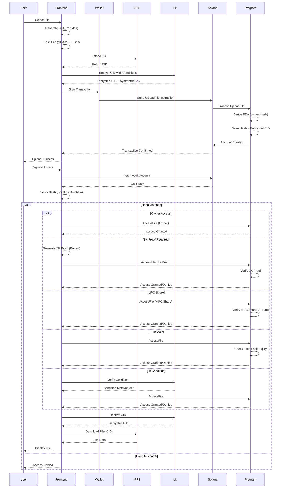
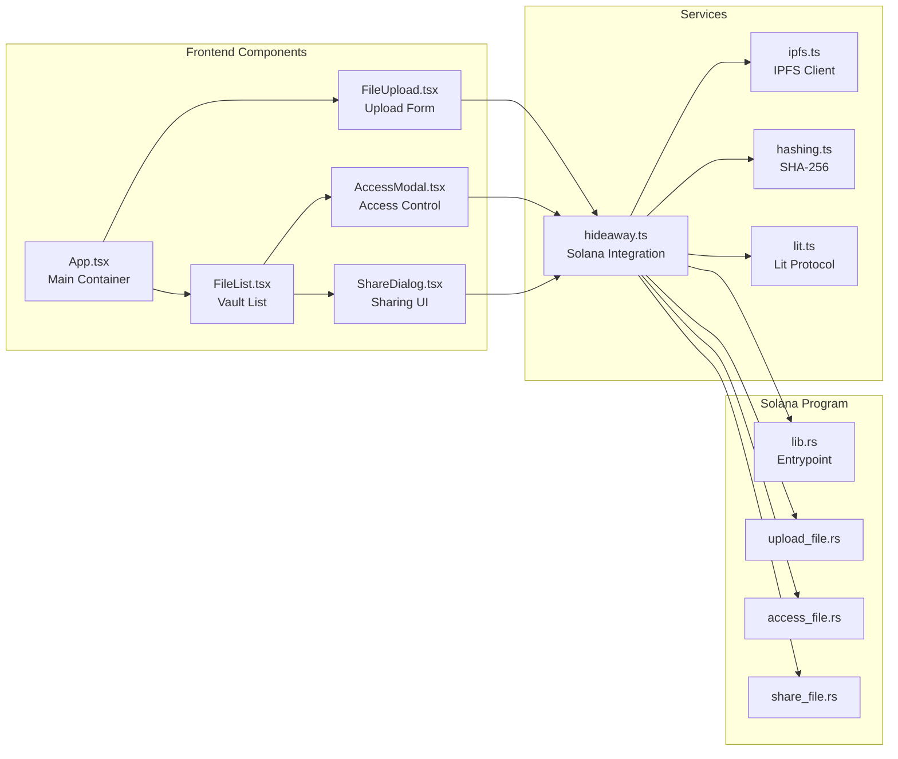
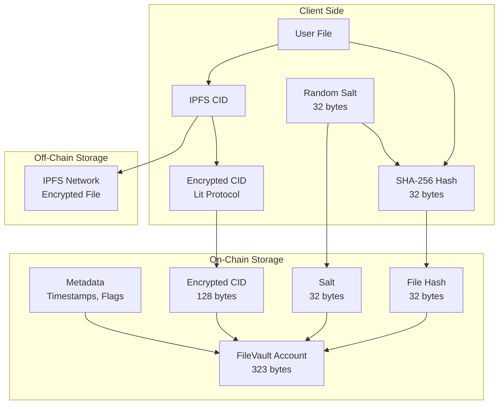
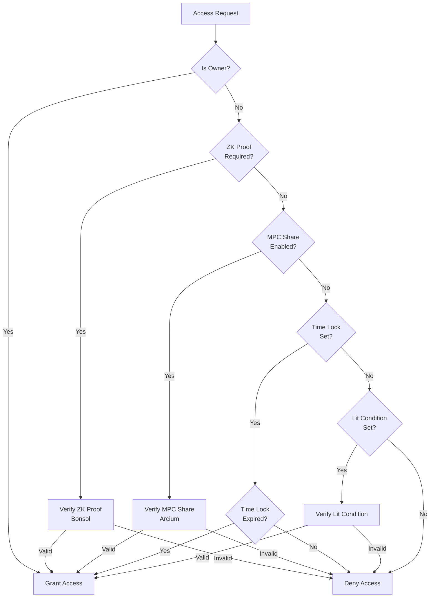
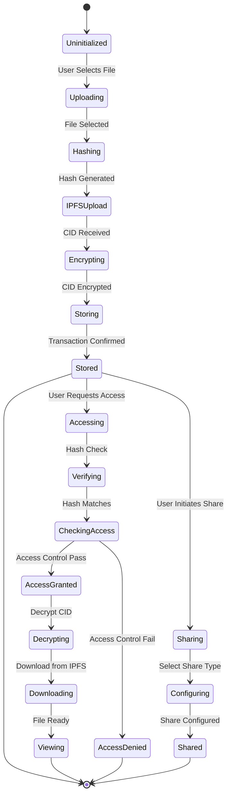

# HideAway User Flow & Workflow

## User Flow Diagram

```mermaid
graph TD
    Start([User Opens HideAway]) --> ConnectWallet{Wallet Connected?}
    ConnectWallet -->|No| Connect[Connect Wallet<br/>Phantom/Solflare]
    Connect --> ConnectWallet
    ConnectWallet -->|Yes| HomePage[Home Page<br/>View Vault List]
    
    HomePage --> Upload[Upload New File]
    HomePage --> ViewVault[View Existing Vault]
    HomePage --> Share[Share File]
    
    Upload --> SelectFile[Select File<br/>Drag & Drop]
    SelectFile --> Hash[Generate Hash<br/>SHA-256 + Salt]
    Hash --> UploadIPFS[Upload to IPFS<br/>Get CID]
    UploadIPFS --> Encrypt[Encrypt CID<br/>Lit Protocol]
    Encrypt --> StoreOnChain[Store on Solana<br/>Hash + Encrypted CID]
    StoreOnChain --> Success[Upload Success<br/>File Added to Vault]
    Success --> HomePage
    
    ViewVault --> SelectVault[Select Vault Entry]
    SelectVault --> VerifyHash{Verify Hash<br/>Match Local File?}
    VerifyHash -->|No| AccessDenied[Access Denied<br/>Hash Mismatch]
    VerifyHash -->|Yes| CheckAccess{Check Access Control}
    
    CheckAccess -->|Owner| GrantAccess[Grant Access]
    CheckAccess -->|ZK Proof| VerifyZK[Verify ZK Proof<br/>Bonsol]
    CheckAccess -->|MPC Share| VerifyMPC[Verify MPC Share<br/>Arcium]
    CheckAccess -->|Time Lock| CheckTime{Time Lock<br/>Expired?}
    CheckAccess -->|Lit Condition| VerifyLit[Verify Lit Condition]
    
    VerifyZK -->|Valid| GrantAccess
    VerifyZK -->|Invalid| AccessDenied
    VerifyMPC -->|Valid| GrantAccess
    VerifyMPC -->|Invalid| AccessDenied
    CheckTime -->|Expired| GrantAccess
    CheckTime -->|Not Expired| AccessDenied
    VerifyLit -->|Valid| GrantAccess
    VerifyLit -->|Invalid| AccessDenied
    
    GrantAccess --> Decrypt[Decrypt CID<br/>Lit Protocol]
    Decrypt --> DownloadIPFS[Download from IPFS<br/>Using CID]
    DownloadIPFS --> ViewFile[View/Download File]
    ViewFile --> HomePage
    
    Share --> SelectShareFile[Select File to Share]
    SelectShareFile --> ChooseShareType{Share Type?}
    ChooseShareType -->|MPC| SetupMPC[Setup MPC Sharing<br/>Arcium]
    ChooseShareType -->|Time Lock| SetTimeLock[Set Time Lock<br/>Future Date]
    ChooseShareType -->|Lit Condition| SetLitCondition[Set Lit Condition<br/>Age/NFT/etc]
    
    SetupMPC --> ShareSuccess[Share Configured]
    SetTimeLock --> ShareSuccess
    SetLitCondition --> ShareSuccess
    ShareSuccess --> HomePage
    
    AccessDenied --> HomePage
```

## Technical Workflow

```mermaid
sequenceDiagram
    participant User
    participant Frontend
    participant Wallet
    participant IPFS
    participant Lit
    participant Solana
    participant Program
    
    User->>Frontend: Select File
    Frontend->>Frontend: Generate Salt (32 bytes)
    Frontend->>Frontend: Hash File (SHA-256 + Salt)
    Frontend->>IPFS: Upload File
    IPFS-->>Frontend: Return CID
    Frontend->>Lit: Encrypt CID with Conditions
    Lit-->>Frontend: Encrypted CID + Symmetric Key
    Frontend->>Wallet: Sign Transaction
    Wallet->>Solana: Send UploadFile Instruction
    Solana->>Program: Process UploadFile
    Program->>Program: Derive PDA (owner, hash)
    Program->>Program: Store Hash + Encrypted CID
    Program-->>Solana: Account Created
    Solana-->>Frontend: Transaction Confirmed
    Frontend-->>User: Upload Success
    
    User->>Frontend: Request Access
    Frontend->>Solana: Fetch Vault Account
    Solana-->>Frontend: Vault Data
    Frontend->>Frontend: Verify Hash (Local vs On-chain)
    alt Hash Matches
        alt Owner Access
            Frontend->>Program: AccessFile (Owner)
            Program-->>Frontend: Access Granted
        else ZK Proof Required
            Frontend->>Frontend: Generate ZK Proof (Bonsol)
            Frontend->>Program: AccessFile (ZK Proof)
            Program->>Program: Verify ZK Proof
            Program-->>Frontend: Access Granted/Denied
        else MPC Share
            Frontend->>Program: AccessFile (MPC Share)
            Program->>Program: Verify MPC Share (Arcium)
            Program-->>Frontend: Access Granted/Denied
        else Time Lock
            Frontend->>Program: AccessFile
            Program->>Program: Check Time Lock Expiry
            Program-->>Frontend: Access Granted/Denied
        else Lit Condition
            Frontend->>Lit: Verify Condition
            Lit-->>Frontend: Condition Met/Not Met
            Frontend->>Program: AccessFile
            Program-->>Frontend: Access Granted/Denied
        end
        Frontend->>Lit: Decrypt CID
        Lit-->>Frontend: Decrypted CID
        Frontend->>IPFS: Download File (CID)
        IPFS-->>Frontend: File Data
        Frontend-->>User: Display File
    else Hash Mismatch
        Frontend-->>User: Access Denied
    end
```

## Component Interaction Flow

```mermaid
graph LR
    subgraph "Frontend Components"
        App[App.tsx<br/>Main Container]
        FileUpload[FileUpload.tsx<br/>Upload Form]
        FileList[FileList.tsx<br/>Vault List]
        AccessModal[AccessModal.tsx<br/>Access Control]
        ShareDialog[ShareDialog.tsx<br/>Sharing UI]
    end
    
    subgraph "Services"
        HideawayService[hideaway.ts<br/>Solana Integration]
        IPFSService[ipfs.ts<br/>IPFS Client]
        HashingService[hashing.ts<br/>SHA-256]
        LitService[lit.ts<br/>Lit Protocol]
    end
    
    subgraph "Solana Program"
        Program[lib.rs<br/>Entrypoint]
        UploadInstruction[upload_file.rs]
        AccessInstruction[access_file.rs]
        ShareInstruction[share_file.rs]
    end
    
    App --> FileUpload
    App --> FileList
    FileList --> AccessModal
    FileList --> ShareDialog
    
    FileUpload --> HideawayService
    HideawayService --> HashingService
    HideawayService --> IPFSService
    HideawayService --> LitService
    HideawayService --> Program
    
    AccessModal --> HideawayService
    ShareDialog --> HideawayService
    
    HideawayService --> UploadInstruction
    HideawayService --> AccessInstruction
    HideawayService --> ShareInstruction
```

## Data Flow

```mermaid
flowchart TD
    subgraph "Client Side"
        File[User File]
        Salt[Random Salt<br/>32 bytes]
        Hash[SHA-256 Hash<br/>32 bytes]
        CID[IPFS CID]
        EncryptedCID[Encrypted CID<br/>Lit Protocol]
    end
    
    subgraph "On-Chain Storage"
        VaultAccount[FileVault Account<br/>323 bytes]
        StoredHash[File Hash<br/>32 bytes]
        StoredSalt[Salt<br/>32 bytes]
        StoredEncryptedCID[Encrypted CID<br/>128 bytes]
        Metadata[Metadata<br/>Timestamps, Flags]
    end
    
    subgraph "Off-Chain Storage"
        IPFSStorage[IPFS Network<br/>Encrypted File]
    end
    
    File --> Hash
    Salt --> Hash
    File --> CID
    CID --> IPFSStorage
    CID --> EncryptedCID
    Hash --> StoredHash
    Salt --> StoredSalt
    EncryptedCID --> StoredEncryptedCID
    StoredHash --> VaultAccount
    StoredSalt --> VaultAccount
    StoredEncryptedCID --> VaultAccount
    Metadata --> VaultAccount
```

## Access Control Decision Tree

```mermaid
graph TD
    AccessRequest[Access Request] --> CheckOwner{Is Owner?}
    CheckOwner -->|Yes| Grant[Grant Access]
    CheckOwner -->|No| CheckZK{ZK Proof<br/>Required?}
    
    CheckZK -->|Yes| VerifyZK[Verify ZK Proof<br/>Bonsol]
    VerifyZK -->|Valid| Grant
    VerifyZK -->|Invalid| Deny[Deny Access]
    
    CheckZK -->|No| CheckMPC{MPC Share<br/>Enabled?}
    CheckMPC -->|Yes| VerifyMPC[Verify MPC Share<br/>Arcium]
    VerifyMPC -->|Valid| Grant
    VerifyMPC -->|Invalid| Deny
    
    CheckMPC -->|No| CheckTime{Time Lock<br/>Set?}
    CheckTime -->|Yes| CheckExpiry{Time Lock<br/>Expired?}
    CheckExpiry -->|Yes| Grant
    CheckExpiry -->|No| Deny
    
    CheckTime -->|No| CheckLit{Lit Condition<br/>Set?}
    CheckLit -->|Yes| VerifyLit[Verify Lit Condition]
    VerifyLit -->|Valid| Grant
    VerifyLit -->|Invalid| Deny
    
    CheckLit -->|No| Deny
```

## State Transitions

```mermaid
stateDiagram-v2
    [*] --> Uninitialized
    Uninitialized --> Uploading: User Selects File
    Uploading --> Hashing: File Selected
    Hashing --> IPFSUpload: Hash Generated
    IPFSUpload --> Encrypting: CID Received
    Encrypting --> Storing: CID Encrypted
    Storing --> Stored: Transaction Confirmed
    Stored --> [*]
    
    Stored --> Accessing: User Requests Access
    Accessing --> Verifying: Hash Check
    Verifying --> CheckingAccess: Hash Matches
    CheckingAccess --> AccessGranted: Access Control Pass
    CheckingAccess --> AccessDenied: Access Control Fail
    AccessGranted --> Decrypting: Decrypt CID
    Decrypting --> Downloading: Download from IPFS
    Downloading --> Viewing: File Ready
    Viewing --> [*]
    AccessDenied --> [*]
    
    Stored --> Sharing: User Initiates Share
    Sharing --> Configuring: Select Share Type
    Configuring --> Shared: Share Configured
    Shared --> [*]
```
